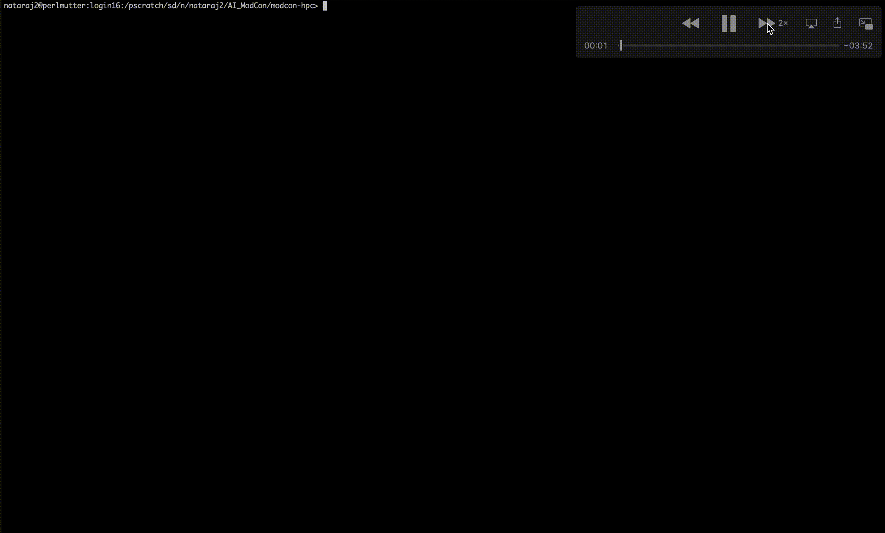

# Fine-Tuning Mistral 7B on Perlmutter GPUs

## What is needed?

Instruction-response pairs 

1. `source /pscratch/sd/n/nataraj2/mistral-env/bin/activate`
2. `python3 FineTuning.py`

This animation demonstrates the fine-tuning workflow of the Mistral-7B model on NERSC Perlmutter GPUs for use within AMReX-based applications.

